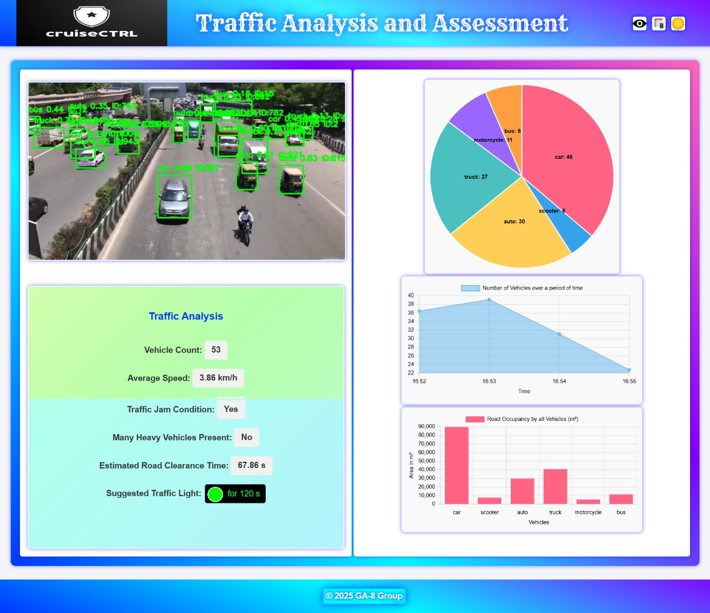

# SafeRydz


# 🚦 Intelligent Traffic Perception System 🚗🛣️

Welcome to our **Intelligent Traffic Perception System** – a cutting-edge solution designed to **revolutionize traffic management**, **enhance safety**, and **provide actionable insights** for smart cities! 🌍✨

---

## 🔍 Multi-Class Detection  
Our system leverages **YOLOv8** 🦾 to detect and classify multiple objects in real time, including:  
🚗 **Cars** | 🚶 **Pedestrians** | 🏍 **Bikes** | 🚌 **Buses** | 🚦 **Traffic Signals**  

This ensures **comprehensive traffic analysis**, enabling real-time monitoring of road activity and improving safety for all road users.  

---

## 🛣️ Lane Detection & Analysis  
Using advanced **lane segmentation (UNet)**, our system:  
✔️ **Identifies and analyzes lane boundaries**  
✔️ **Tracks vehicles moving through each lane** on roads with multiple lanes  
✔️ **Provides insights into traffic distribution & congestion patterns**  

This data is crucial for optimizing traffic flow and ensuring road safety! 🏎️💨  

---

## 🏁 Lane Segmentation  
Beyond basic lane detection, our system performs **detailed lane segmentation** to:  
🔹 Understand the **exact road layout** in complex scenarios like **intersections, merges, and roundabouts**  
🔹 **Integrate with object detection** to identify:  
   - 🚘 Vehicles **drifting out of lanes**  
   - 🚶 Pedestrians **crossing illegally**  

This **context-aware system** makes roads safer and traffic analysis more precise! 🚥⚠️  

---

## 🛤️ Dynamic Route Optimization  
🔄 **Real-time traffic data + lane occupancy analysis = Optimized Routes!**  
📍 In high-traffic conditions, our system:  
✅ Identifies the **shortest & most efficient routes** 🚗💨  
✅ Suggests **alternative paths** to reduce congestion 🚦  
✅ Improves travel efficiency and minimizes delays ⏳  

---

## 📊 Real-Time Dashboard  
Our **Python-based dashboard** provides:  
📹 **Live traffic video feeds**  
🚗 **Lane-wise vehicle counts**  
🌡️ **Traffic density heatmaps**  
⚠️ **Alerts for lane departures & violations**  

This **user-friendly interface** makes traffic monitoring **seamless & efficient!** 🎛️  

---

🚑 Accident Assistant (New Feature!)
A built-in Accident Response Assistant in Streamlit empowers instant decision-making in emergencies.

🛠️ Key Capabilities:
📍 Location Input: Enter accident coordinates or choose from past locations

📸 Scene Analysis: Upload an image to get accident details using Groq’s LLaMA 4 model

🏥 Nearest Facilities: Detect closest hospital and police station

📞 Contact Retrieval: Auto-fetch emergency contact info using LLM queries

📚 Location History: Automatically saves previously entered accident sites

🧠 Powered by Groq API and geospatial Overpass API for smart responses in critical moments.

---


🏆 Why Choose Our System?
✨ Multi-class detection for all road users
✨ Lane segmentation for deep traffic insights
✨ Real-time optimization to reduce jams
✨ Accident support with smart hospital/police suggestions
✨ Transformer-enhanced YOLOv8 for high precision

Key Features 🚀
🚗 Multi-Class Detection (YOLOv8)
🛣️ Lane Segmentation (UNet)
📊 Lane-wise Vehicle Count
🚦 Violation Alerts
📈 Real-Time Dashboard
🚨 Dynamic Route Optimization
🤖 Transformer-based Attention
🚑 Accident Response Module

To **further enhance accuracy**, we’ve **augmented YOLOv8** with **Transformer-based attention modules**. 🤖🚀  

[weights](https://drive.google.com/drive/folders/1NZIYadoCz4glykqLLA1GVUS-SUTHAQ-q?usp=drive_link)

---

## 🚀 Let’s Build the Future of Transportation! 🌎  
This system is designed to **redefine urban mobility** and **pave the way for smart cities**.  
Join us in **transforming traffic management!** 🏙️💡  




Here’s a list of **key features** and **usage** for your Intelligent Traffic Perception System, formatted with emojis (stickers) for a visually appealing README file:

---

### **Key Features** 🚀

- 🚗 **Multi-Class Detection**: Detects cars, pedestrians, bikes, buses, and traffic signals using **YOLOv8**.
- 🛣️ **Lane Segmentation**: Identifies lane boundaries and road layouts with **UNet** for precise traffic analysis.
- 📊 **Lane Traffic Analysis**: Tracks vehicle counts per lane and monitors traffic distribution in real-time.
- 🚨 **Dynamic Route Optimization**: Finds the shortest and most efficient routes during high traffic or obstacles.
- 🌧️ **Robustness in Diverse Conditions**: Trained with synthetic data for fog, rain, and nighttime scenarios.
- 📈 **Real-Time Dashboard**: A Python-based dashboard for live video feeds, traffic heatmaps, and analytics.
- 🔍 **Attention Mechanisms**: Enhances detection accuracy for small or occluded objects using Transformer-based modules.
- 🚦 **Traffic Violation Alerts**: Detects lane departures, illegal crossings, and other violations.

---

### **Usage** 🛠️

1. **Install Dependencies**:
   ```bash
   pip install ultralytics opencv-python torch torchvision
   ```

2. **Run the System**:
   ```python
   python main.py --source traffic_video.mp4 --weights yolov8n.pt
   ```

3. **Access the Dashboard**:
   - Launch the Python-based dashboard to view real-time traffic analysis.
   ```bash
   python traffic_analysis_dash.py
   ```

4. **Analyze Traffic**:
   - Monitor lane-wise vehicle counts, traffic density, and optimized routes.
   - Receive alerts for traffic violations or congestion.

5. **Export Results**:
   - Save detection results, lane analysis, and route optimization data for further analysis.

---

## 🤝 Contributors 💡  
👨‍💻 **Team JAWAAN**  

- 🧠 **Sandeep Sarkar** - ML Engineer  
- 🤖 **Atyasha Bhattacharyya** - AI/ML Developer & Data Analyst    
- 💻 **Subhanjan Saha** - Software Developer  
- 🎮 **Ishaan Karmakar** - Web Developer

---

🚀 Let’s Build the Future of Transportation! 🌎
Join us in transforming traffic perception, optimizing mobility, and enabling faster emergency responses.
Let’s make our roads smarter and safer—together! 🌐💡
